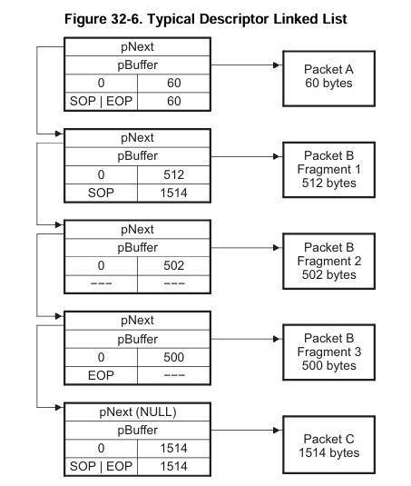
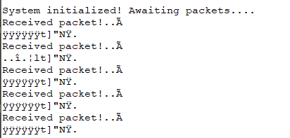

# Serial Packet Echo

## Resources

- [TMS570LS12x/11x Technical Reference Manual](https://www.ti.com/lit/ug/spnu515c/spnu515c.pdf) (~p. 1911)
- `example_sci_uart_9600.c` (HALCoGen → Help → Examples → TMS570LS12x_11x)
- `example_EMAC_Loopback_TxRx.c` (HALCoGen → Help → Examples → TMS570LS12x_11x)

## Description

This guide outlines a simple program that explores interacting with data sent over ethernet, as well as UART logging for viewing data when not in debug mode.

## About Ethernet Packets

Ethernet packets are automatically handled by the board as long as the correct HAL code is generated. As discussed in the [simple ethernet example](../simple-ethernet/), packets are automatically stored in memory.

As they are processed, the EMAC updates a linked list of packet descriptors.

Packet descriptors consist of linked lists with eight fields (counting flags as one field) in four words:


Each of these descriptors point to the next, in a linked list.



## Code

1. This program requires setting up a new [CCS project](../halcogen-and-ccs/), and then following the instructions in both the HALCoGen SCI (Serial Commnication Interface) and EMAC (Ethernet Media Access Control) examples.
2. Once the CCS project is set up, modify `sys_main.c` to define and call to a custom function that we'll define externally.

```c
/* ... */

/* USER CODE BEGIN (1) */
void serial_echo_main(uint8 emacAddr[6U]);
/* USER CODE END */

/* ... */

int main(void)
{
/* USER CODE BEGIN (3) */
   serial_echo_main(emacAddress);
/* USER CODE END */

    return 0;
}

/* ... */
```

3. Create a custom main file in the root directory of the project. I called mine `serial-echo.c`, since it echoes packets it recieves over the serial interface.
4. The code for that is in `serial_echo.c`. Some notes:
   - Descriptor pointer is initialized to the value `0xFC521010`. This value is the default value of the first packet descriptor in the list
   - The external `while(1)` loop would normally be the main program loop, dispatching to a function that contains the internal part of the loop. For this program, though, they didn't need to be separated.
   - `printf` Only works in debug mode. Additionally, since there is no easily provided length, we treat the packet as a null-terminated string. In most cases, it terminates right after the ethernet packets are defined, since the IPv4 code is `0x0800`, and the second byte is a null byte.
   - `printf`s debug mode restriction is why we also use SCI. The SCI function, `sciDisplayText(buf_ptr + buf_offset, 12)`, prints the first 12 characters starting at the defined buf_ptr, which are the dst and src mac addresses of the packet.
   - When there are no more packets, the value of `pNext` is zero. This means we can simply check if its not zero in the internal while loop, and if it is, then we do our processing.

## Output

When we run the program and send packets to it, we get our print statements!


Log statements from `printf`



Log statements from the serial


The first line of the sent packet data, as seen in wireshark.
