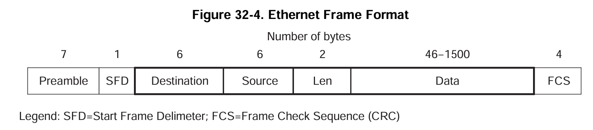
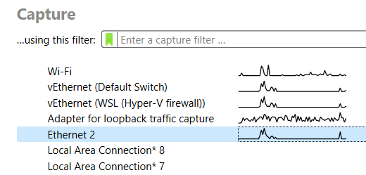
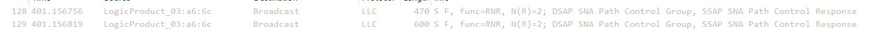
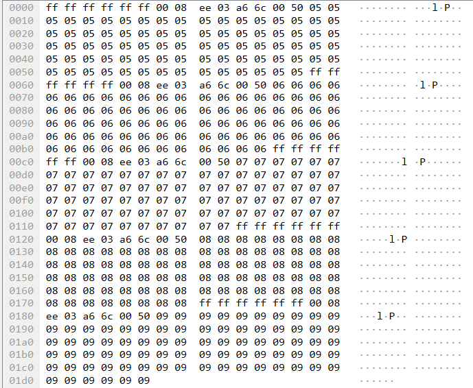
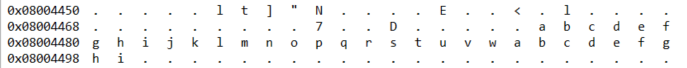
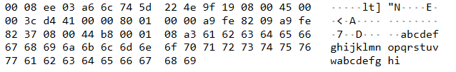

# Simple Ethernet

## Resources

- [Technical Reference Manual (Rev. C) (Ethernet info page 1900)](https://www.ti.com/lit/ug/spnu515c/spnu515c.pdf#page=1892)
- `example_EMAC_Loopback_TxRx.c` (HALCoGen → Help → Examples → TMS570LS12x_11x)
- [HALCoGen Ethernet Driver and lwIP Integration Demonstration - Texas Instruments Wiki (archive.org)](https://web.archive.org/web/20210114141117/https://processors.wiki.ti.com/index.php/HALCoGen_Ethernet_Driver_and_lwIP_Integration_Demonstration)

## Description

Using the provided EMAC example, we can send packets from the board and observe them through wireshark. Additionally, we can see data sent to the board appear in the board’s memory, without any extra code.

## Setting Up the Board

Using the `example_EMAC_Loopback_TxRx.c` project example file, we can get the ethernet to turn on and connect to a listening PC. Follow the instructions at the top of the loopback example to set HALCoGen up with the correct settings.

> [!NOTE]
> Since the example is for loopback, the board sends info to itself, and only recieves it from itself. If we do not enable loopback, we can interface with the board using an external device, which is our ultimate goal. So, **do not enable loopback**. Otherwise, follow the instructions at the top of the loop back example.


> Taken from the Technical Reference Manual (Page 1900).
> An ethernet frame. Note that the Preamble, SFD, and FCS are presumably handled by the PHY (physical) layer and HALCoGen code, and we only need to worry about the destination, source, length, and data.

```cpp
void create_packet()
{
    int i,j;


    for(i=0;i<5;i++)
    {
    pack[i].tot_len = size1;
    pack[i].len = size2;


    // Destination address: 0xffffffffffff (broadcast packet)
    // Destination address set to all ones is a broadcast packet
    for(j=0;j<6;j++) {
        data[i][j] = 0xffu;
    }


    // Source address: (Our MAC address, set in HALCoGen)
    // The default MAC address is: 00:08:EE:03:A6:0C
    for(j=0;j<6;j++) {
        data[i][j+6]= emacAddress[j];
    }


    // Length: (2 bytes, forced to length of 80)
    data[i][12] = 0;
    data[i][13] = 80;


    // Data: A sequence of 80 5s, 6s, 7s, 8s, and 9s.
    for(j=0;j<80;j++)
    {
        data[i][j+14] = i+5;
    }


    pack[i].payload = &data[i][0];
    if(i!=4)
    pack[i].next = &pack[i+1];
    }
    pack[4].next= NULL;
}
/* USER CODE END */
```

> The create packet method with comments

> [!NOTE]
> The ff:ff:ff:ff:ff:ff MAC address is the broadcast MAC address. This makes it so all devices will receive this, including our connected PC.

## Wireshark

We use Wireshark to read packets coming from the board. By selecting the Ethernet option when opening Wireshark, we can see just packets sent over ethernet. The little graph should be blank until you plug into the board, when your operating system detects a connection and begins probing for information.

> [!NOTE]
> This spike does not mean that the board is responding, just that your OS is probing the connection because it detected that the ethernet link was physically completed.



When opening the capture, we can see a lot of activity happening as the PC probes the connection. It will not get a response, but there will be a lot of activity whenever it notices the ethernet signal changing, like when the PHY layer on the board is busy or the board is resetting. We use a filter to ignore ethernet packets originating from our PC.

`eth.src != 74:5d:22:4e:9f:19`

> [!IMPORTANT]
> Here, 74:5d:22:4e:9f:19 is the MAC address of my PC. It should be replaced with the MAC address of your device.

Then, we can run the provided code. If loopback mode is off, we should see two packets sent that originate from the board.


> The packets sent by the board


> The hex data of the first packet. Note the first six octets (broadcast dst MAC), second six octets (src MAC), and then the two length octets (0x0050, or 80)

## Sending Data to the Board

We can send data to the board using the `ping` command. To do this, we need to assign the board an IP address, since `ping` can only take a IP address.

On windows, we can use the `arp` command to assign an IP address to a mac address. Open up an *admin* terminal, and run

`arp -s 169.254.130.55 00-08-ee-03-a6-6c`

The ip address is arbitrary, but the 169.254.xxx.xxx range is used for local communication. The MAC address is the mac address of the board. Use arp -a to confirm the table entry was successfully added.

Then, run

`ping 169.254.130.55`

or, to spam the board

`ping 169.254.130.55 -t -w 100`

or ping whatever ip address you chose for the board. Then, we can change the wireshark filter so it now also shows requests going to the board. Here is my filter:

`eth.src != 74:5d:22:4e:9f:19 || eth.dst == 00:08:ee:03:a6:6c`

Again, the ethernet source is my specific mac address. You should see pings appear in the wireshark log as they go out.

Currently, the board is not configured to respond to anything, so the pings don’t get a response. However, as long as the board is not at a breakpoint, the board should log the ethernet packets to memory, which can be viewed. As specified in the example program, by opening the memory browser and navigating to address `0xFC521010`, we can see a list of buffer descriptors. The format of the buffer descriptors is described on page 1908 of the technical reference, but the second word of every 4 word group is the actual location of a buffer. Following one of those gets us this:


> Data as seen in the CCS memory browser (character view)


> Data as seen in wireshark
