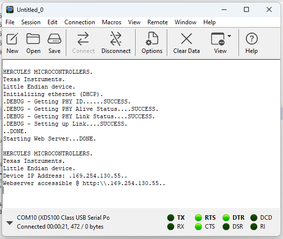
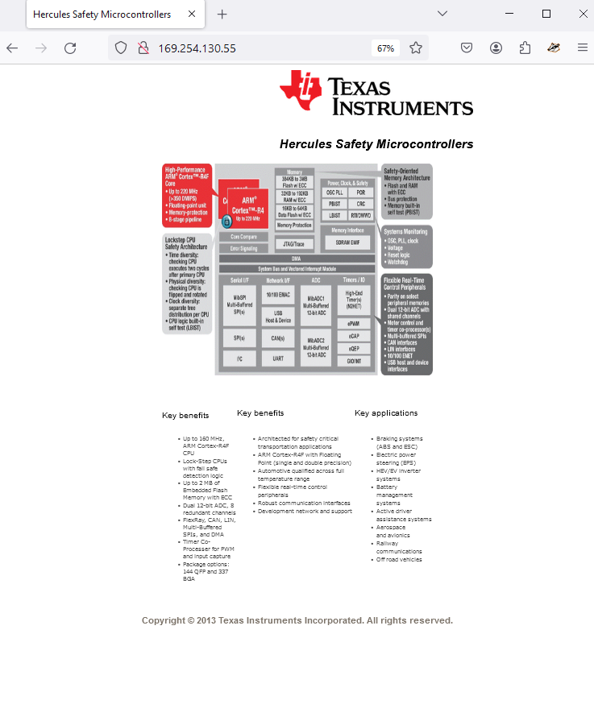
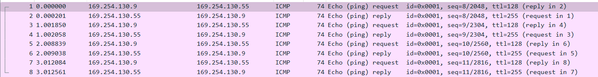

# Webserver

## Resources

[LwIP - Software Examples for Hercules Processors](https://git.ti.com/cgit/hercules_examples/hercules_examples/tree/Application/LwIP/v00.04.00)

## Description

This example uses the LwIP library to run a simple webserver on the board. The LwIP libary is the one we'll be using for TCP/IP communications, so this is a good example of how it works at a high level, although we'll be handling the packet data ourselves instead of delegating it to the http handler as seen in this example.

## Setting up

1. Clone the github repo from the resources link ([This one](https://git.ti.com/cgit/hercules_examples/hercules_examples/)) (Clone links are at the bottom).
2. Set up a serial terminal. This isn't strictly necessary, but it's useful to see the `sciDisplayText` calls when you don't want to launch the program in debug mode to see printfs, or when a program is already using it, like this one is. I recommend [CoolTerm](https://freeware.the-meiers.org/), and it should work out of the box once you connect the JTAG wire (the USB mini port). When you launch the program in debug mode, this is the wire that transfers printfs. It also carries serial data from the SCI (Serial Communications Interface), which can be read by CoolTerm.
3. In CCS, open the `hercules_examples/Application/LwIP/v00.04.00/TMS570LS12x/Build-TMS570LS12x`. This folder contains CCS project metadata, as well as the HALCoGen build files, so it should work out of the box. You can inspect the HALCoGen/CCS settings yourself, but since we're opening the board specific project, you shouldn't need to change anything.
4. In `lwip_main.c` (`example/hdk/src`) change the ip address to use static ip instead of DHCP. We ran into issues with initialization using DHCP, and its also easier to set up the ARP table with a static ip.
   - Make sure to comment out the dynamic ipAddr line, otherwise the initialization process will fail.
   - The IP address is arbitrary, chosen for the same reasons as in the [ethernet example](../simple-ethernet/). See that guide for setting up the ARP table.
   - The gateway is the same as the IP address, since we're on a very small local network and don't need a dedicated gateway.
   - The netmask corresponds to the 169.254.xxx.xxx range.

```c
/* Initialze the lwIP library, using DHCP.*/
sciDisplayText(sciREGx, txtEnetInit, sizeof(txtEnetInit));
// ipAddr = lwIPInit(0, macAddress, 0, 0, 0, IPADDR_USE_DHCP);
/* Uncomment the following if you'd like to assign a static IP address. Change address as required, and uncomment the previous statement. */
uint8 ip_addr[4] = { 169, 254, 130, 55};
uint8 netmask[4] = { 255, 255, 0, 0 };
uint8 gateway[4] = { 169, 254, 130, 55};
ipAddr = lwIPInit(0, macAddress,
        *((uint32_t *)ip_addr),
        *((uint32_t *)netmask),
        *((uint32_t *)gateway),
        IPADDR_USE_STATIC);
```

5. Build and deploy! We don't need debug mode unless we want to set breakpoints, since the logging is done over the SCI UART.



6. Connect to the webserver by going to your browser, and typing in the ip address. As long as you've set up your arp table correctly, you should see the webserver! Note that the URI is the ip address we set.



7. Additionally, you can ping the server like we did in the [ethernet example](../simple-ethernet/). This time, we will recieve a response from the board, that you can observe over wireshark.


